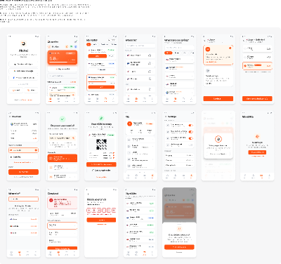

# Openline mobile Figma sources

This folder preserves native mobile design snapshots alongside the buildable [React gallery](../../mobile/app-screens/). The supplied `.fig` is stored unchanged, rather than unpacked or converted into a different source format.

## September 24, 2026 snapshot

- **Native source:** [openline-mobile-screens-2026-09-24.fig](openline-mobile-screens-2026-09-24.fig).
- **Embedded thumbnail:** [openline-mobile-screens-2026-09-24-thumbnail.png](openline-mobile-screens-2026-09-24-thumbnail.png), extracted from the uploaded file without modification.
- **Export metadata:** File name `Openline Mobile Screens`; exported at `2026-09-24T10:11:04.866Z`.
- **Companion code:** [mobile/app-screens/](../../mobile/app-screens/), with 19 screen entries.
- **Live design reference:** [Openline mobile design](https://www.figma.com/design/xOFkfha4CK3pNQQz46tKzo/), as supplied in the accompanying README. Access depends on the Figma file's sharing permissions.

## Opening and updating

Import the `.fig` file into Figma to inspect and edit the native document. Archive integrity and export metadata have been checked; the document has not been reimported into Figma as part of this repository intake.

The companion README identifies two pages in the live design: `Openline Mobile - app screens` and `Mobile screens - 22 Sep - 19 frames (capture)`. These are supplied references, not a claim that the live file and archived snapshot remain synchronized.

Use dated filenames for future snapshots and add a row to [LINKS.md](../LINKS.md) when a live source changes. Review snapshots for private material before adding them to this public repository.
